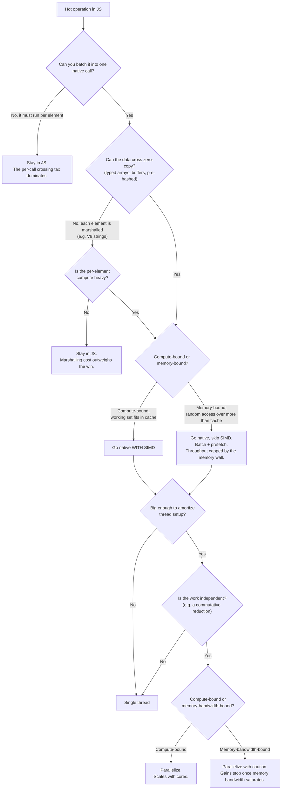

# Is it worth going native? And can you push it parallel?

A decision aid distilled from the measurements in this repo. Every branch is
backed by a number from the benchmark, listed in the legend below.

## Why each branch (the evidence)

- **Batch or stay home.** A native `add()` called once per element ran at 3.0M
  ops/s and *lost* to a plain JS `Set` at 4.3M. Batching the same work into one
  call (`addAll`) reached 4.8M. If you cannot collapse the per-element crossings,
  native is not worth it.
- **Zero-copy is where native pays.** Handing data across as a typed array or
  pre-hashed buffer (`addInts`, `addHashes`) hit 54M to 69M ops/s, roughly 14x
  the per-element path. The dominant boundary cost was not the crossing itself
  (about 1.6x) but extracting each element from a V8 string (about 11x). If your
  elements must be marshalled one by one, most of the native win is eaten before
  the kernel runs.
- **SIMD does not beat the memory wall.** For random access over a table larger
  than cache, throughput fell from about 132M ops/s (table in L2) to about 50M
  (table in RAM), and the AVX2 kernel was statistically indistinguishable from
  the scalar one. SIMD speeds up arithmetic, not waiting on memory. Native still
  helps here, through batching and prefetch, but reach for SIMD only when the
  work is compute-bound and fits in cache.
- **Parallel needs independent work and enough of it.** This filter parallelizes
  because its insert is a bitwise OR, which is commutative and associative, so
  shards merge without coordination. Two conditions still gate it: the job must
  be large enough to pay back thread setup, and if the kernel is memory-bound
  the speedup tapers once the cores saturate memory bandwidth rather than
  compute. Parallelism multiplies a compute bound; it cannot multiply a
  bandwidth bound.

## One-line summary

Go native when you can **batch** and hand data over **zero-copy**. Add **SIMD**
only when the work is **compute-bound and cache-resident**. Go **parallel** only
when the work is **independent, large, and not already bandwidth-bound**.
